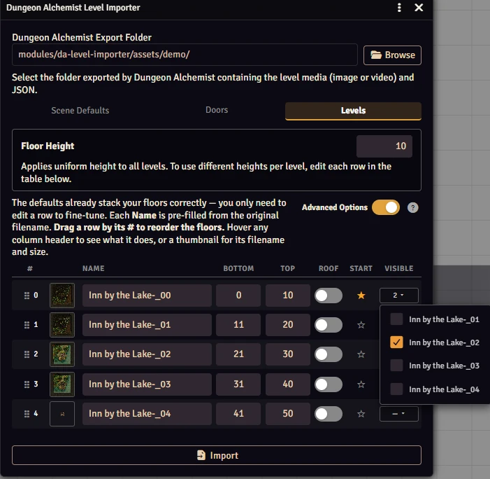

# Dungeon Alchemist Level Importer

Foundry VTT v14 module that imports a Dungeon Alchemist multi-level export and creates a Scene using native v14 Scene Levels.

<p align="center"></p>

[](https://buymeacoffee.com/mestredigital)

# How it Works

Dungeon Alchemist exports multi-floor maps as sibling file pairs — one **media file** (image *or* video) and one `.json` data file per floor, named with a numeric suffix (e.g. `TavernMap-_0.webp`, `TavernMap-_0.json`, `TavernMap-_1.webp`, `TavernMap-_1.json`).

<p align="center"></p>

This module reads all pairs in a folder, parses each JSON for wall, door, and light data, and creates a **single Foundry VTT Scene** where each floor becomes a native **Scene Level** (a feature introduced in Foundry VTT v14). Walls, doors, and lights are bound to their respective level so they only activate when that floor is active — no manual setup required.

Supported media:

- **Images:** `.jpg`, `.jpeg`, `.png`, `.webp`
- **Animated maps (video):** `.webm`, `.mp4`, `.m4v` — imported as animated Scene Level backgrounds.

If a floor ships more than one media file for the same name, the importer picks one deterministically by priority (**video > webp > png > jpg**), so the result never depends on file ordering.

## Requirements

- Foundry VTT **v14 or later** is required. The native Levels system used here is not available in earlier versions.
- Each export folder should contain **only** the files for a single map. The importer pairs every media file with a sibling `.json` by filename stem, so mixing exports from different maps would merge unrelated floors into one Scene. If it detects more than one map in a folder it **warns** you (but does not block the import).

## Features

The module exposes three entry points, each available both as a console/macro API call and as a button injected into the **Scenes directory** sidebar:

| API | Sidebar button | Purpose |
| --- | --- | --- |
| `DA.Importer()` | **Dungeon Alchemist Importer** | Import a Dungeon Alchemist export into a new multi-level Scene. |
| `DA.EditLevels()` | **DA Edit Levels** | Edit the levels of the Scene you're currently viewing. |
| `DA.AddRegion()` | **DA Stairs** | Place a multi-level stair/elevator transit region. |

### Importer Dialog (`DA.Importer()`)

A tabbed dialog. Select your Dungeon Alchemist export folder with **Browse**, configure the tabs, and click **Import**. Your last-used door texture, door sound, background color, grid opacity, and Copy Media toggle are **remembered per browser** and restored the next time you open the dialog.

#### Scene Defaults tab
- **Background Color** applied to all levels.
- **Grid Opacity** slider (0 = invisible, 1 = fully visible).
- **Copy Media to World** toggle (off by default): copies all floor media into `worlds/<your-world>/da-imported/<map-name>/`, renames them to `kebab-case`, and points the Scene at the copies for a self-contained, portable world.

#### Doors tab
- **Door texture selector** with 25 Foundry canvas door options and a real-time hover preview.
- **Door sound selector** with 21 Foundry door sound options and a play-preview button to audition before import.
- Any wall exported with `door=1` automatically receives the selected texture (with swing animation) and sound key on import.

#### Levels tab
After a folder is selected, one row is built per detected floor. Defaults already stack floors correctly (`0–10`, `11–20`, `21–30`, …) — you only edit a row to fine-tune.

- **Thumbnail** of each floor's media — video floors show a paused first frame in the row and an **animated preview on hover**. Broken/undecodable media shows a hatched placeholder. Floors whose media exceeds Foundry's **~50 MB** recommendation for animated maps get an amber outline + size tooltip and a summary notification.
- **Name** pre-filled from the original filename (editable); the filename and size are shown in the thumbnail tooltip.
- **Bottom / Top elevation** inputs per floor, plus a **Floor Height** field that recalculates all rows at once.
- **Drag-to-reorder**: drag a row by its **#** handle (marked with a grip icon) to change the stacking order. Elevations restack to the default ladder automatically, while each floor's Name, Roof, Start, and Visible settings travel with it.
- **Advanced Options**: a toggle beside the intro text (its state is remembered per browser) reveals the columns most maps don't need; the **?** icon shows a help tooltip explaining them:
  - **Roof** — marks a floor as a roof/ceiling sitting on the floor below; it then renders only while that lower floor is active, positioned automatically (no elevation numbers). A floor whose filename contains `roof` is auto-detected and pre-marked. The bottom floor can't be a roof.
  - **Start (★)** — which floor players see first when the Scene opens (defaults to the bottom floor).
  - **Visible** — a dropdown listing the other levels; checked levels are added to that floor's `visibility.levels`, keeping them on-screen simultaneously (atriums, balconies, glass floors). Roof and Visible are merged (deduplicated) if both are set.

Import is **blocked with a clear message** if any level's bottom elevation is greater than or equal to its top.

### Edit Levels (`DA.EditLevels()`)

Open the Scene you're viewing, then run `DA.EditLevels()` (or click **DA Edit Levels**) to edit its existing levels: rename them, change bottom/top elevations, reorder them (drag the **#**), and adjust Roof / Start / Visible, then **Apply Changes**. Edits are written in place **by level id**, so all walls, lights, and regions stay bound — no re-linking.

> This edits the *existing* levels. Adding or removing a level is not supported yet, and reordering restacks elevations to the default ladder.

### Region Tool (`DA.AddRegion()`)

Open the Scene you want to add stairs/elevators to, then run `DA.AddRegion()` (or click **DA Stairs**) to configure a transit region spanning multiple consecutive levels. Select a starting level and how many levels above and below should share the region, then place it on the canvas:

- **Click** to drop a default one-grid-square region, or
- **Drag** to draw the region's footprint with a live preview.

A single region document is created and bound to all target levels using the native `changeLevel` behavior. Once placed, it can be moved/resized with Foundry's native Region tools. Press **Escape** to cancel placement.

## Usage

Open the importer from the Scenes directory sidebar button, or from a macro / the console:

```js
DA.Importer();    // import a new multi-level scene
DA.EditLevels();  // edit the levels of the scene you're viewing
DA.AddRegion();   // add a stair/elevator region to the scene you're viewing
```

# 📦 Installation

Install via the Foundry VTT Module browser or use this manifest link:

```javascript
https://raw.githubusercontent.com/brunocalado/da-level-importer/main/module.json
```

# ⚖️ Credits & License

* **Code License:** GNU GPLv3.

* **Demo:** The maps are from Dungeon Alchemist and are under their license: https://www.dungeonalchemist.com/terms-of-use
